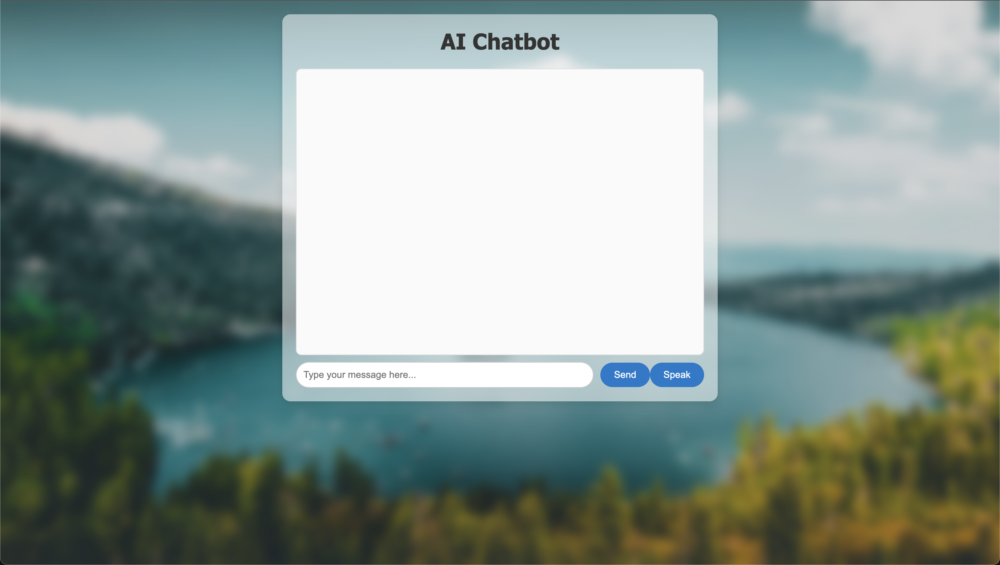

# Google GenerativeAI Chatbot

A simple web-based chatbot interface powered by Google GenerativeAI using FastAPI. Features a clean, modern UI with real-time text generation and typing animations.



## Features

- **Google GenerativeAI Text Generation**: Uses Google GenerativeAI to generate responses
- **Modern Web Interface**: Clean, responsive design with glassmorphism effects  
- **Real-time Chat**: Interactive chatbox with typing animations
- **Background Blur Effects**: Stylish backdrop with image overlay
- **Typing Animation**: Word-by-word response display for natural feel
- **Button State Management**: Visual feedback during processing
- **Voice Input Feature**: speech-to-text input using the Web Speech API

## Prerequisites

- Python 3.7+
- pip (Python package manager)

## Installation

1. Clone the repository:
```bash
git clone <https://github.com/MobinEbrahimkhani/AI-chatbox>
cd <AI-chatbox>
```

2. Install required dependencies:
```bash
pip install -r Required_modules.txt
```

Or install manually:
```bash
pip install fastapi uvicorn transformers torch
```

## Project Structure

```
your-project/
├── AI-chatbox.py          # FastAPI server with Google GenerativeAI integration
├── Required_modules.txt   # List of required Python packages
├── static/
│   ├── index.html         # Main chat interface
│   ├── styles.css         # Styling with glassmorphism effects
│   ├── script.js          # Frontend JavaScript logic
│   └── 4.jpg             # Background image
└── README.md
```

## Usage

### Local Development

Run the server locally:
```bash
python -m uvicorn AI-chatbox:app --reload
```

Then open your browser and navigate to `http://localhost:8000`

### Network Access

To run the server accessible from other devices on your network:
```bash
python -m uvicorn AI-chatbox:app --host globalip --port 8000
```

## Voice Input

This chatbot now supports speech-to-text input using the Web Speech API (works in modern browsers like Chrome and Edge).

### How to Use:
  1.	Click the "Speak" button next to the input box.
  2.	Speak your question or message.
  3.	The recognized text will appear in the input field.
  4.	Press Submit to send the message as usual.

Notes:
  - Works best in Chrome and Edge.
  - May not work in some browsers (e.g. Firefox or Safari).
  - Requires microphone permissions.


## How It Works

1. **Backend**: FastAPI serves the static files and provides a `/generate` endpoint
2. **AI Model**: Google GenerativeAI model processes user input and generates responses
3. **Frontend**: JavaScript handles user interactions and displays responses with typing animation
4. **Styling**: CSS creates a modern glassmorphism interface with backdrop effects

## API Endpoints

- `GET /` - Serves the main chat interface
- `POST /generate` - Accepts JSON with `prompt` field and returns generated text

## Customization

- **Change AI Model**: Modify the `pipeline` initialization in `AI-chatbox.py`
- **Adjust Response Length**: Change `max_length` parameter in the generate endpoint
- **Styling**: Edit `styles.css` to customize colors, fonts, and effects
- **Background**: Replace `4.jpg` with your preferred background image

## Technical Details

- **Framework**: FastAPI for high-performance web API
- **AI Library**: Google generativeAI with the free API_key
- **Frontend**: Vanilla JavaScript with modern ES6+ features
- **Styling**: CSS3 with backdrop-filter effects and smooth animations
- **Voice Input**: Uses Web Speech API on the frontend for speech-to-text.

## Contributing

Feel free to fork this project and submit pull requests for improvements!

## License

This project is open source and available under the MIT License.

## Troubleshooting

- **Port already in use**: Change the port number in the uvicorn command
- **Model loading issues**: Ensure you have sufficient RAM and stable internet for initial model download
- **Static files not loading**: Verify the `static` folder structure matches the project layout
